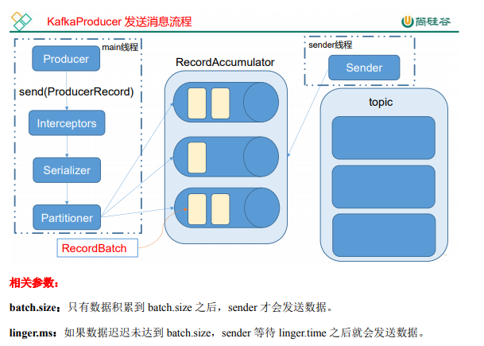

# 消息发送流程

Kafka 的 Producer 发送消息采用的是异步发送的方式。在消息发送的过程中，涉及到了 两个线程——main 线程和 Sender 线程，以及一个线程共享变量——RecordAccumulator。

 main 线程将消息发送给 RecordAccumulator，Sender 线程不断从 RecordAccumulator 中拉取 消息发送到 Kafka broker。

Interceptor: 拦截器

Serializer: 序列化器

Parititioner: 分区器 
